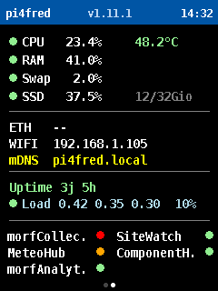
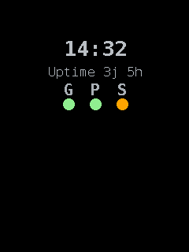

# morfDashboard

*Read in another language: **English** (this document) · [Français](README.fr.md).*

[](CHANGELOG.md)


A system dashboard for the Raspberry Pi, shown on a small **ILI9341 or ST7789 SPI
screen (240 × 320)**. At a glance it gives the health of the machine - CPU,
memory, disk, load, network and services - plus the **presence of the workshop's
desktop apps** (ComponentHub, SiteWatch…) on the local network.

The goal: know the state of the Raspberry in under a second, with no keyboard and
no main screen.

## Display overview



    ┌────────────────────────────────────┐
    │ pi4fred          v1.2.1     13:25:59│   header: host / version / time
    ├────────────────────────────────────┤
    │ ● CPU    2.1 %        43.7 °C        │   health dot + temperature
    │ ● RAM   42.9 %                       │
    │ ● Swap   2.1 %                       │
    │ ● SSD    8.7 %       8 / 98 Gio      │   % used + used / total
    ├────────────────────────────────────┤
    │ ETH   192.168.1.42                   │
    │ WIFI  --                             │
    │ mDNS  pi4fred.local                  │
    ├────────────────────────────────────┤
    │ Uptime 3j 4h              REBOOT!    │   if an unexpected reboot is detected
    │ ● Load 0.15 0.22 0.30   4 %          │   1/5/15 min averages + % of cores
    ├────────────────────────────────────┤
    │ DashBoard       ● ComponentH.   ●    │   systemd services (left) +
    │ GatewayLab      ● SiteWatch     ●    │   desktop apps via morfBeacon
    │ MeteoHub        ●                    │   (right) - up to 6, names abbreviated
    └────────────────────────────────────┘

The **dots** change color against thresholds:

-   🟢 **Green**: normal / online
-   🟠 **Orange**: warning threshold
-   🔴 **Red**: critical / offline

## Hardware

See [docs/fr/HARDWARE.md](docs/fr/HARDWARE.md) *(FR)* for the screen, pinout and
SPI, and [docs/fr/CABLAGE.md](docs/fr/CABLAGE.md) *(FR)* for the detailed wiring.

## Installation

See [docs/fr/INSTALL.md](docs/fr/INSTALL.md) *(FR)* to install it as a `systemd`
service (auto-start at boot).

Quick test, without installing the service:

``` bash
cd ~/Codage/Python/morfDashboard
python3 dashboard.py
```

## Configuration

All settings live in [config.py](config.py).

### Health thresholds

Each metric has a warning and a critical threshold:

``` python
CPU_WARNING = 70      ;  CPU_CRITICAL = 90
RAM_WARNING = 80      ;  RAM_CRITICAL = 95
SWAP_WARNING = 20     ;  SWAP_CRITICAL = 50
TEMP_WARNING = 65     ;  TEMP_CRITICAL = 75      # °C
SSD_WARNING = 85      ;  SSD_CRITICAL = 95
LOAD_WARNING = 100    ;  LOAD_CRITICAL = 150     # % of cores
```

`LOAD` is expressed as a percentage of cores: `100 %` = every core fully busy.

### Monitored services (systemd / ESP32)

Displayed services are defined in `SERVICE_LABELS` - the **key** is the unit name,
the **value** the displayed label:

``` python
SERVICE_LABELS = {
    "dashboard":  "DashBoard",     # local systemd service (systemctl is-active)
    "gatewaylab": "GatewayLab",    # ESP32 (network probe)
    "meteohub":   "MeteoHub",      # ESP32 (network probe)
}
```

A **local** service (such as the dashboard itself) is checked with
`systemctl is-active`. An **ESP32** service, which has no systemd, is also
declared in `NETWORK_SERVICES` and checked with a TCP probe against its web
server.

### Desktop apps (morfBeacon heartbeat)

On top of the systemd services, the dashboard **listens** on the local network
for the desktop apps (**ComponentHub**, **SiteWatch**, future tools) that
broadcast a small "I'm alive" UDP heartbeat (morfBeacon protocol, port `45454`).
Nothing to configure on the network side: automatic discovery, no IP to know. An
app with no heartbeat for `BEACON_OFFLINE_AFTER` seconds is shown offline.

``` python
BEACON_APPS = {
    "ComponentHub": "ComponentHub",
    "SiteWatch":    "SiteWatch",
}
```

Adding a future project is a single line. The status area shows up to **6
monitored items across two columns** (systemd services + desktop apps); names
that are too long are abbreviated with a trailing ".".

### Unexpected-reboot alert

If a reboot-watch script writes a report under `/home/morfredus/Logs/`, the
dashboard shows a red `REBOOT!` badge on the `Uptime` line. Settings in
`config.py` (`REBOOT_ALERT_*`); acknowledge without deleting the logs via
`python3 reboot_ack.py`. Details: [docs/fr/INSTALL.md](docs/fr/INSTALL.md) *(FR)*.

### Version

The number shown in the header is read from the `VERSION` file at the repository
root. When absent, `dev` is shown.

## Standby screen (anti-burn-in / power saving)



After `SCREENSAVER_IDLE_SECONDS` (60 s) with **no SSH activity**, the dashboard
gives way to a minimal **standby frame** - a small box repositioned at every
refresh - showing the clock, the uptime and a row of three status dots:

-   **G** - global / thermal: 🟢 OK · 🟠 hot · 🔴 critical
-   **P** - CPU load (4 levels): 🟢 < 50 % · 🟡 50-70 % · 🟠 70-90 % · 🔴 ≥ 90 %
-   **S** - services: 🟢 all up · 🟠 at least one down (never red; the
    `dashboard` service is excluded)

The backlight drops to `BL_STANDBY` and returns to `BL_ACTIVE` as soon as you
touch an SSH session. Presence is detected from SSH terminal activity
(`activity.py`), pending a real presence sensor.

The backlight is driven by **PWM** on `GPIO18` (the BL pin): three configurable
brightness steps rather than a plain on/off.

``` python
SCREENSAVER_ENABLED = True       # False = dashboard always on, never standby
SCREENSAVER_IDLE_SECONDS = 60    # SSH inactivity before standby
BL_ACTIVE = 100                  # backlight (%) when present
BL_STANDBY = 15                  # backlight (%) in standby
BL_OFF = 0                       # backlight (%) when manually off
BACKLIGHT_PWM = True             # False = on/off backlight (no dimming)
```

These are LCD panels (ST7789 / ILI9341): permanent burn-in is essentially an OLED
issue, so the real win here is the lower backlight (power, LED lifespan); the
moving frame only guards against transient retention.

### Manual screen control (`screenctl.py`)

On top of the automatic logic, the screen accepts a **persistent manual
override**, handy to switch it off deliberately at night without stopping the
service. A small, strictly local command-line tool (no network):

``` bash
python3 screenctl.py off      # force off (screen deliberately dark)
python3 screenctl.py on       # force on (stays at full brightness)
python3 screenctl.py auto     # hand back to automatic management
python3 screenctl.py status   # show the current mode
```

The mode (`auto` / `on` / `off`) is written to a state file under
`/var/lib/morfsystem/morfdashboard/backlight.state` (systemd StateDirectory) and
re-read by the service on every loop: the command takes effect within seconds,
without a restart, and **survives reboots**. In `on` mode the standby frame keeps
moving (anti-burn-in) but without dimming; only `auto` restores the standby drop.

## Detailed metrics on demand (SSH)

The screen is passive: it only shows **presence** (online / offline). To read an
app's **detailed metrics** without a keyboard, run `beacon_status.py` over SSH -
it discovers the live apps, queries their `/status` endpoint and writes a
human-friendly Markdown report (`beacon_status.md`):

``` bash
python3 beacon_status.py                  # console + beacon_status.md
python3 beacon_status.py --app SiteWatch   # a single app
python3 beacon_status.py --listen 8        # longer discovery window
python3 beacon_status.py --no-file         # console only
```

## Documentation

The in-depth guides are currently written in **French** under
[`docs/fr/`](docs/fr/README.md); an English index is at
[`docs/en/`](docs/en/README.md).

| Document | Contents |
|---|---|
| [docs/fr/ARCHITECTURE.md](docs/fr/ARCHITECTURE.md) *(FR)* | Project structure and the role of each module |
| [docs/fr/HARDWARE.md](docs/fr/HARDWARE.md) *(FR)* | Hardware and pinout |
| [docs/fr/CABLAGE.md](docs/fr/CABLAGE.md) *(FR)* | Detailed wiring |
| [docs/fr/INSTALL.md](docs/fr/INSTALL.md) *(FR)* | systemd service installation |
| [CHANGELOG.md](CHANGELOG.md) | Version history |
| [ROADMAP.md](ROADMAP.md) | Planned work |
| [CONTRIBUTING.md](CONTRIBUTING.md) | Contribution guide |

## License

Distributed under the [GPL-3.0-only license](LICENSE). © 2026 morfredus.
