# Fabrication du module écran + capteur - pi4fred

Retour à l'[index de la documentation](README.md).

---

Ce document décrit la fabrication du **module compact** qui se fixe au-dessus du
boîtier du Raspberry Pi 4 (pi4fred). Il porte l'écran du dashboard et le capteur
de présence, et il remplace le montage de test à base de breadboard, de nappe
GPIO 40 broches et de T-Cobbler.

C'est la mise en pratique de la convention de câblage figée dans
[`CONVENTIONS-CABLAGE-PI4.md`](CONVENTIONS-CABLAGE-PI4.md) : une plaque à trous
soudée, des connecteurs détrompés et démontables, et seulement les fils utiles
qui sortent du boîtier. Le brochage broche à broche vit dans ce document de
convention ; celui-ci se concentre sur le **geste de fabrication** et l'ordre des
étapes.

> ℹ️ Le montage vise trois qualités : **compact** (il coiffe le boîtier sans
> déborder), **démontable** (retirer l'écran ou le capteur sans dessouder le
> reste) et **reproductible** (câblage figé une fois pour toutes, même les
> broches en réserve).

---

## 1. Matériel

Matériel déduit du montage photographié. Les références exactes peuvent varier
selon l'approvisionnement ; les caractéristiques (pas, tension, pinout) sont ce
qui compte.

| Élément | Détail | Rôle |
|---|---|---|
| Raspberry Pi 4 Model B | dans un boîtier ABS noir avec emplacement ventilateur | l'hôte du dashboard |
| Ventilateur | `FAN-COOLING FD3510B5`, 5 V 0,12 A, 35 mm | refroidissement, **reste dans le boîtier** |
| Plaque à trous | double face, 6 x 8 cm, pas **2,54 mm** (marquage `PY-6cmX8cm`), repères de coordonnées imprimés | support mécanique et câblage du module |
| Écran TFT SPI | 2,4", contrôleur **ST7789** (compatible **ILI9341** selon `config.py`) | affichage du tableau de bord |
| Capteur de présence | radar 24 GHz **HLK-LD2410C**, sérigraphie `TX RX OUT GND VCC` | détection de présence (lue en UART) |
| Connecteurs | **JST-XH 2,54 mm** détrompés : 3, 5 et 6 broches (embases mâles à souder + boîtiers + contacts sertis) | alimentation, signaux écran, signaux capteur - démontables |
| Barrettes femelles | sécables 2,54 mm | recevoir l'écran et le capteur de façon amovible |
| Fil de câblage souple | silicone ~26 AWG (orange sur les photos) | distribution des alimentations et liaisons au dos de la plaque |
| Nappe Dupont | fils femelle-femelle arc-en-ciel | faisceau extérieur entre les JST du module et le GPIO du Pi |
| Entretoises | colonnettes nylon noir (M2.5) + vis + écrous | fixer la plaque au-dessus du boîtier et caler écran/capteur |
| Fil rouge/noir | déjà présent sur le ventilateur | alimentation du ventilateur (interne) |
| Étain + flux | - | soudure |

---

## 2. Outillage

- fer à souder, étain, flux, tresse à dessouder ;
- pince coupante, pince à dénuder, brucelles ;
- tournevis (vis du boîtier et des entretoises) ;
- sertisseuse JST-XH (ou soudure des contacts) ;
- **multimètre** : contrôle de continuité et des tensions, imposé avant toute
  mise sous tension (voir §5).

---

## 3. Étapes de fabrication

Les figures suivent l'ordre de construction. Les fichiers sont dans
[`images/fabrication/`](images/fabrication/).

### 3.1 Réunir le matériel

Plaque à trous nue et ses entretoises, écran, capteur, connecteurs JST et leurs
boîtiers, nappes. Repérer la **broche 1** de chaque connecteur avant toute
soudure.

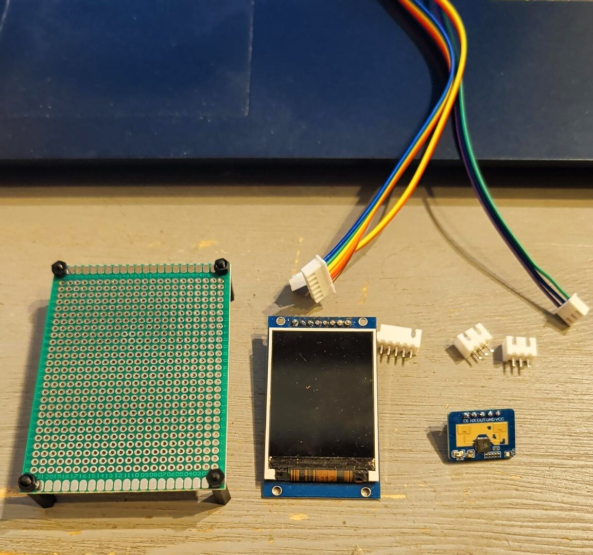

### 3.2 Souder les connecteurs et les embases

Souder côté composants les trois connecteurs JST-XH (alimentation, écran,
capteur) et les barrettes femelles qui recevront l'écran et le capteur. Souder
proprement, sans pont entre broches voisines.

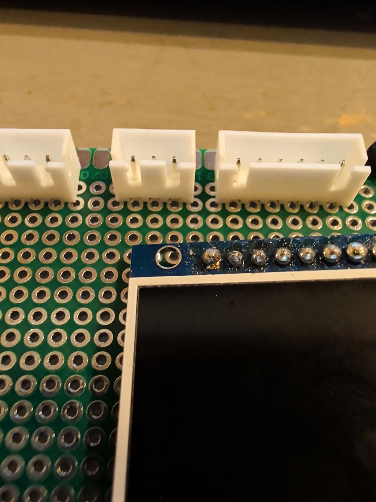

### 3.3 Câbler le dos de la plaque

Au dos, réaliser au fil souple la **distribution des alimentations** (3,3 V vers
l'écran, 5 V vers le capteur, masse commune) et les **liaisons de signaux** entre
les connecteurs et les embases. Garder des trajets courts et repérables.

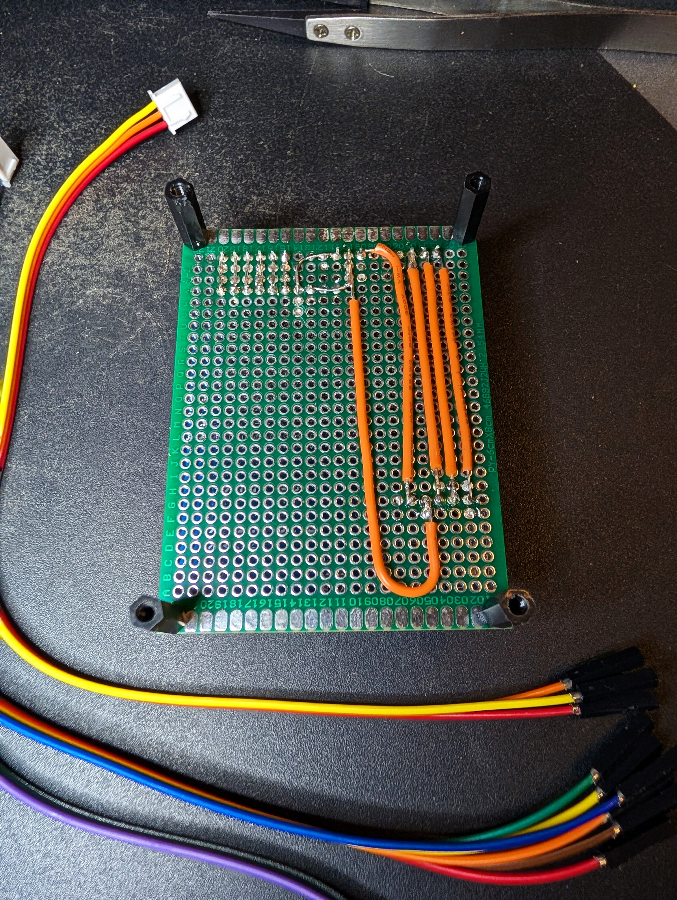

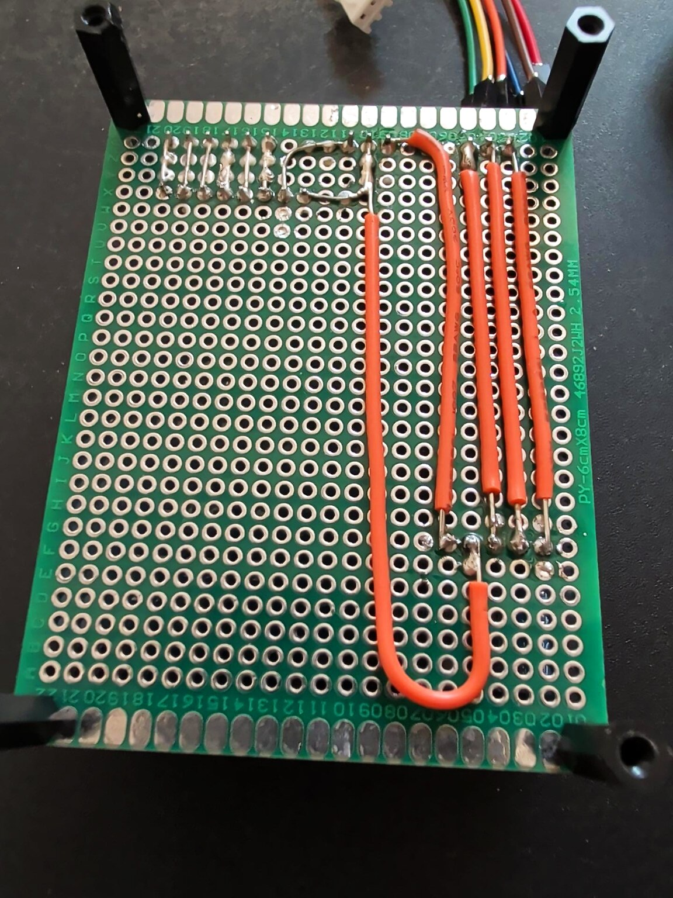

### 3.4 Ajuster le châssis sur le boîtier

Poser les entretoises et présenter la plaque au-dessus du boîtier du Pi. Vérifier
que le faisceau extérieur atteint le GPIO sans forcer et que rien ne gêne la
fermeture du boîtier.

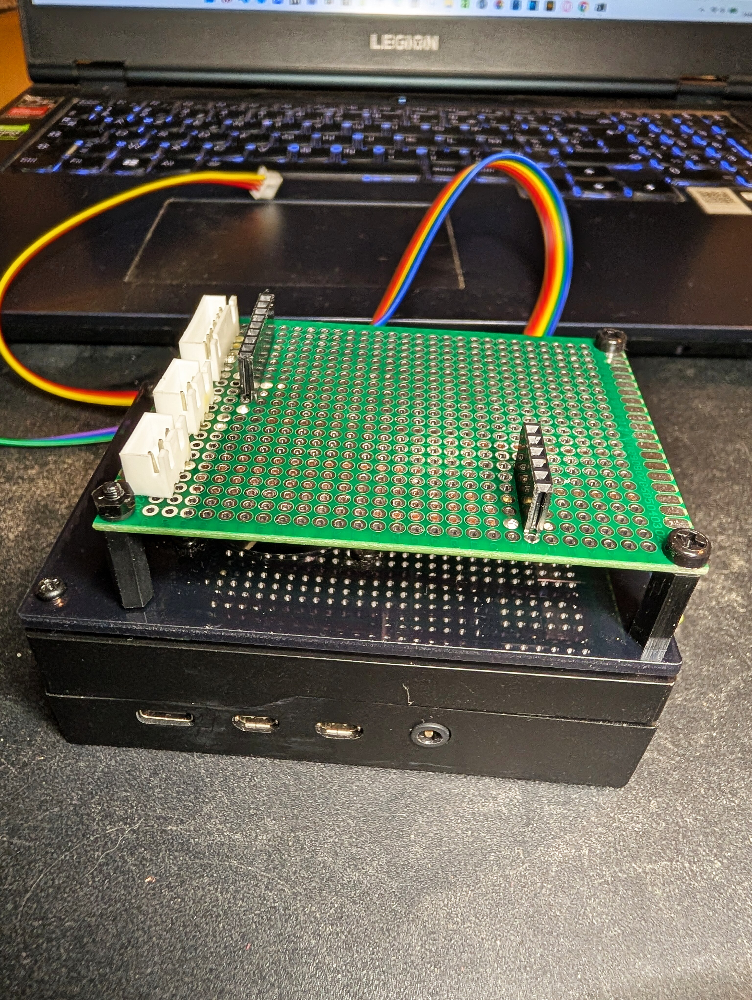

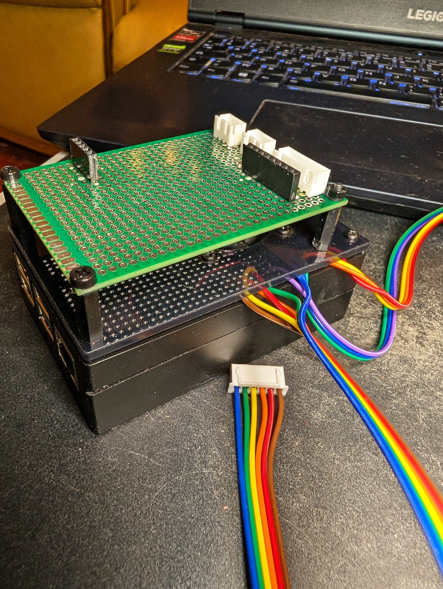

### 3.5 Monter l'écran et le capteur

Enficher l'écran et le capteur HLK-LD2410C sur leurs embases. Le capteur reste
dégagé (l'antenne radar ne doit pas être masquée par une masse métallique).

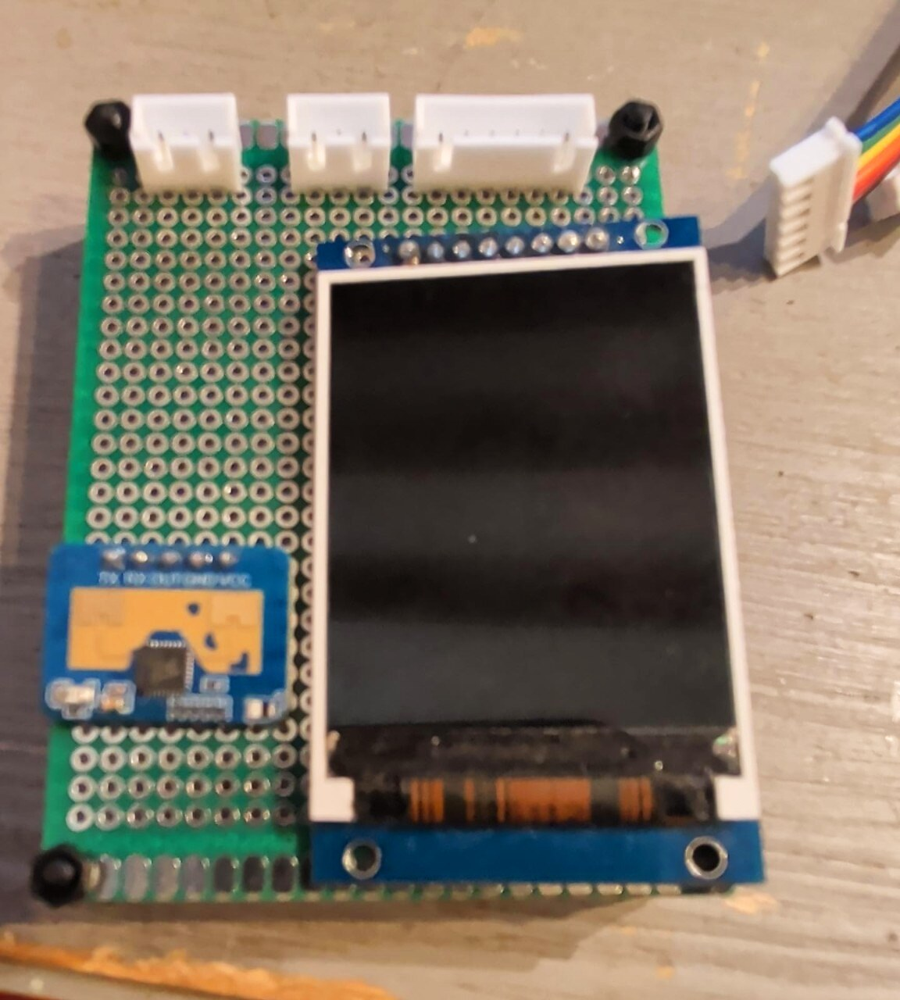

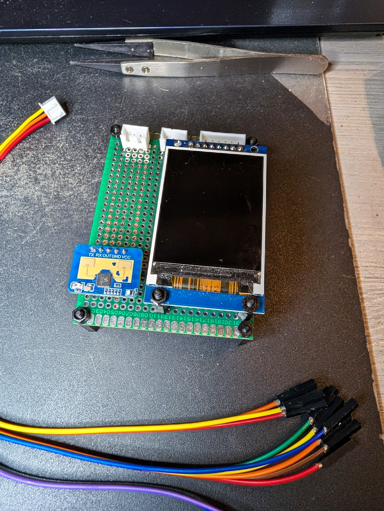

### 3.6 Intégrer le Pi et son ventilateur

Le ventilateur **reste dans le boîtier**, alimenté depuis le Pi. Seuls les fils
utiles sortent vers le module.

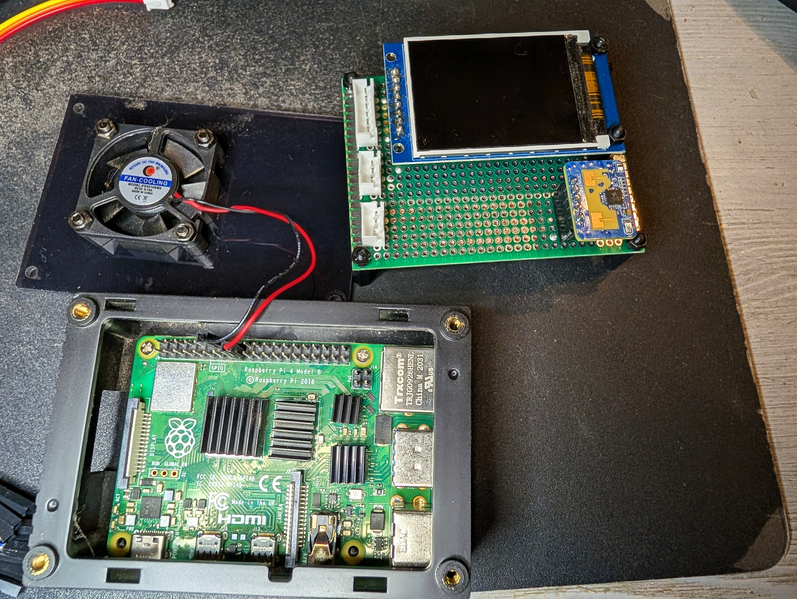

### 3.7 Raccorder le faisceau au GPIO

Brancher les nappes Dupont entre les connecteurs du module et les broches du GPIO
selon [`CONVENTIONS-CABLAGE-PI4.md`](CONVENTIONS-CABLAGE-PI4.md). Douze fils au
total (alimentation + écran + capteur, RX et OUT compris).

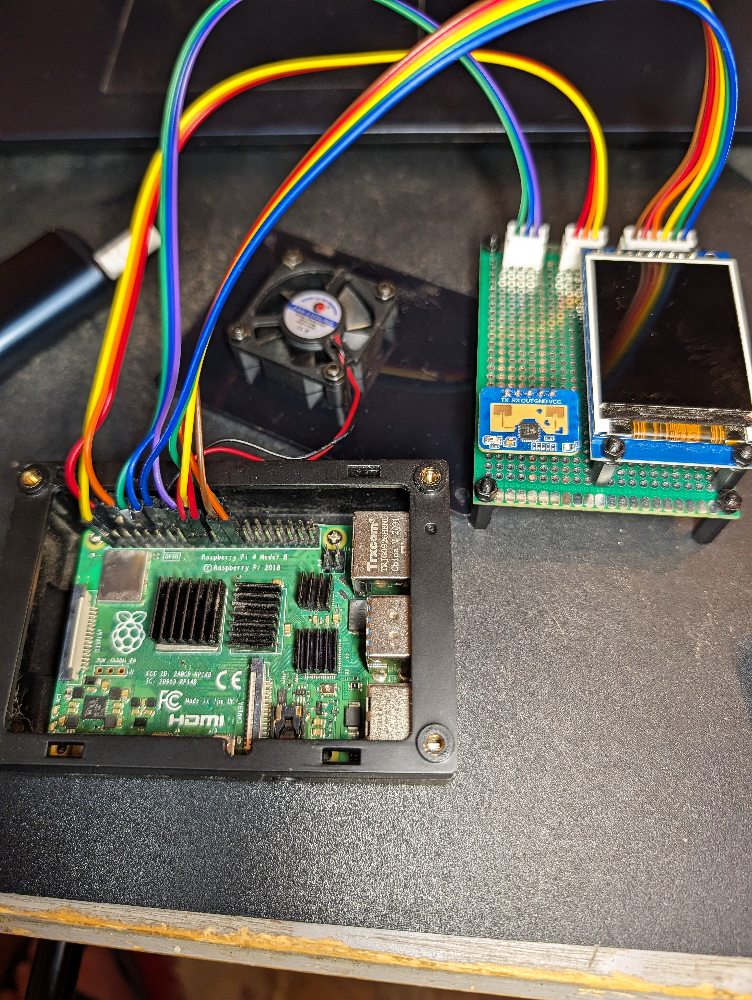

### 3.8 Mettre sous tension

Après les contrôles du §5, alimenter le Pi. Le dashboard s'affiche.

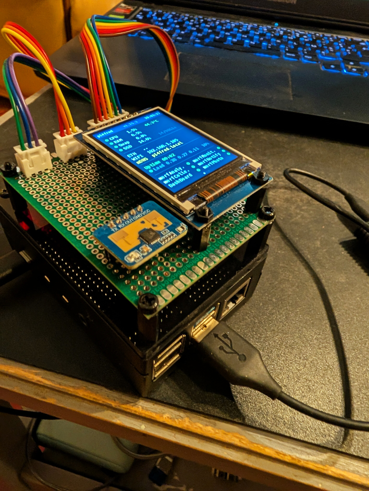

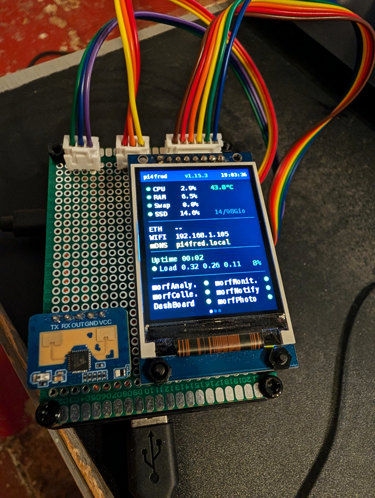

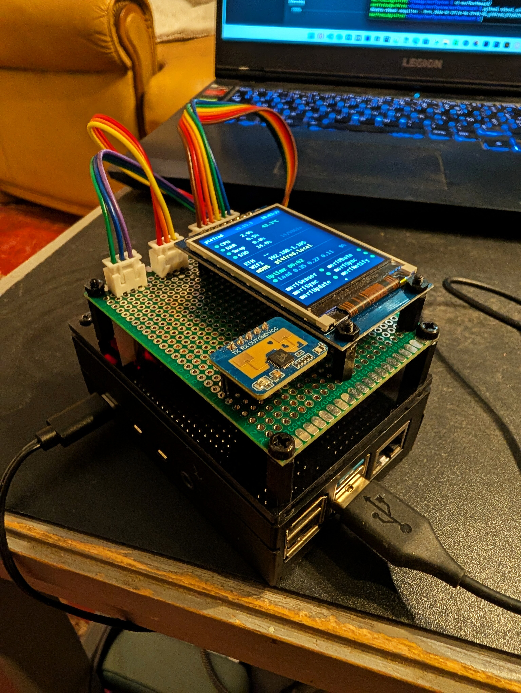

---

## 4. Câblage

Le brochage complet (GPIO, broches physiques, affectation de chaque JST) est
décrit une seule fois, dans ces deux documents :

- [`CONVENTIONS-CABLAGE-PI4.md`](CONVENTIONS-CABLAGE-PI4.md) : convention retenue,
  connecteurs JST, décompte des fils, vue synthétique du GPIO ;
- [`CABLAGE.md`](CABLAGE.md) : câblage détaillé de l'écran et cohabitation avec le
  capteur sur le même en-tête.

Rappel des trois faisceaux détrompés portés par le module :

- **alimentation** : 3,3 V / GND / 5 V (JST-XH 3) ;
- **signaux écran** : SCLK, MOSI, RESET, DC, CS, BL (JST-XH 6) ;
- **signaux capteur** : 5 V, GND, TX, RX, OUT (JST-XH 5), OUT relié à **GPIO23
  (broche 16), en entrée**.

---

## 5. Contrôles avant la première mise sous tension

Repris de la convention de câblage. À ne pas sauter.

1. **Jamais 5 V sur le VCC ni les GPIO de l'écran** (logique 3,3 V).
2. Le LD2410C reçoit **5 V sur VCC**, mais tous ses signaux restent en 3,3 V.
3. **GPIO23 en entrée** : relié à OUT, ne jamais le piloter en sortie.
4. Vérifier au multimètre le niveau réel de OUT avant de le relier au Pi.
5. Contrôler le repérage de la **pin 1 de chaque JST** avant soudure/sertissage.
6. Marquer les connecteurs d'alimentation `3V3 / GND / 5V`.
7. Continuité et absence de court-circuit au multimètre avant branchement au Pi.
8. Mesurer le JST d'alimentation **avant** d'y raccorder l'écran et le capteur.

---

## 6. Résultat

Le module coiffe le boîtier du Pi. L'écran affiche le dashboard (CPU, RAM, swap,
SSD, réseau, uptime, état des services morfSystem), le capteur veille juste
à côté, et chaque périphérique peut être retiré sans toucher aux autres. Le
prototype sur breadboard est retiré.
